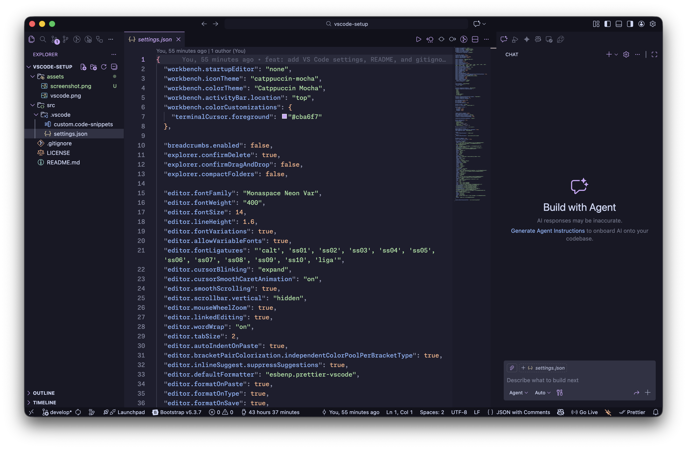
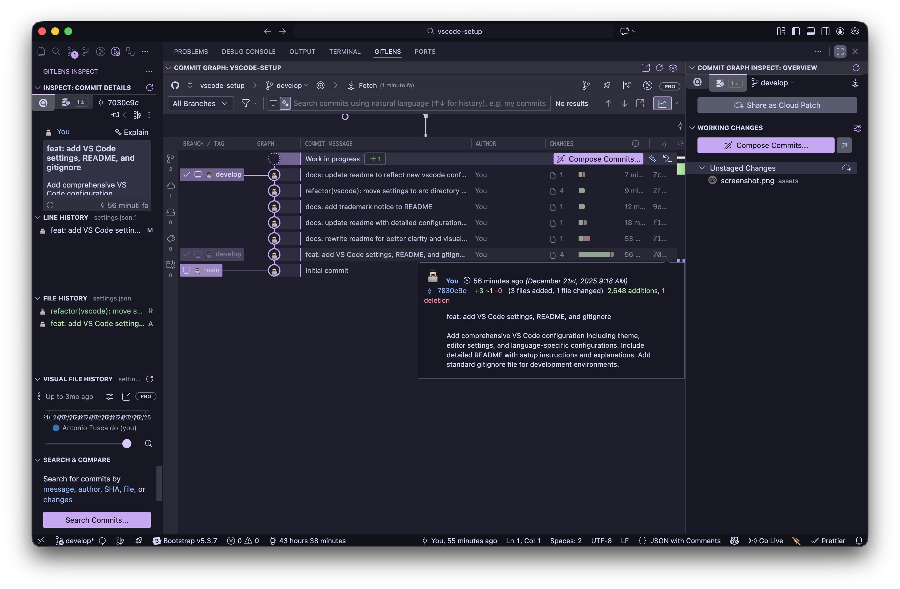

#  Ultimate VS Code Setup

> **_A beautiful, opinionated, and productivity-focused Visual Studio Code template for macOS, Windows, and Linux._**

This repository is my polished VS Code setup: theme, icons, fonts, editor
behavior, keybindings, snippets, tasks, recommended extensions, and a small
maintenance toolchain. It is designed to feel fast, aesthetic, and ready for
real work without hiding the details behind an installer.

---

## ✨ The Vibe

| 🎨 Visual Mood                                                   | ⚡ Daily Flow                                             | 🧩 Workflow Kit                                                        |
| :--------------------------------------------------------------- | :-------------------------------------------------------- | :--------------------------------------------------------------------- |
| Catppuccin Mocha, soft contrast, clean icons, modern typography. | Format on save, smart Git, useful tasks, fast navigation. | Frontend, Python, Java, Markdown, WordPress, AI, Docker, remote tools. |

| Theme                                                                                | 🔤 Editor Font     | 🖥️ Terminal Font | 🧠 Style                              |
| :----------------------------------------------------------------------------------- | :----------------- | :--------------- | :------------------------------------ |
|  Catppuccin Mocha | Monaspace Neon Var | MesloLGS NF      | Elegant, productive, a little magical |

| Preview                                                              | Color | Hex       |
| :------------------------------------------------------------------- | :---- | :-------- |
|  | Mauve | `#cba6f7` |
|      | Sky   | `#89dceb` |
|    | Pink  | `#f5c2e7` |
|  | Green | `#a6e3a1` |

---

## 🖼️ Gallery

| Editor Glow                                      | Workflow Focus                                   |
| :----------------------------------------------- | :----------------------------------------------- |
|  |  |

---

## 🚀 Quick Start

The safest way to try this setup is to create a dedicated VS Code Profile first.
That keeps your current VS Code environment untouched while you test the full
experience.

1. Open VS Code.
2. Go to **Manage** > **Profiles** > **Create Profile...**.
3. Choose **Create an Empty Profile**.
4. Name it `Ultimate Setup`.
5. Open the command palette and run **Preferences: Open User Settings (JSON)**.
6. Copy the contents of `src/.vscode/settings.json` into that file.
7. Optionally copy `keybindings.json`, `tasks.json`, and
   `custom.code-snippets`.
8. Install the recommended extensions from `src/.vscode/extensions.txt`.

> 🧠 This setup intentionally uses manual copy steps. You stay in control and
> can review every file before replacing an existing VS Code configuration.

---

## 🗂️ Source Of Truth

All reusable VS Code files live in `src/.vscode`.

```text
src/.vscode/
├── settings.json              # Main VS Code user settings
├── keybindings.json           # Optional keyboard shortcuts
├── tasks.json                 # Reusable VS Code tasks
├── custom.code-snippets       # Personal snippets for daily workflow
├── extensions.json            # Workspace recommendations
└── extensions.txt             # Installable extension list for the CLI
```

Root-level files keep the repository polished: formatting, commit hooks,
markdown linting, commit message rules, and project metadata.

---

## 📦 Install Extensions

First, make sure the `code` command is available:

```bash
code --version
```

If it is missing, open VS Code and run
**Shell Command: Install 'code' command in PATH** from the command palette.

### macOS And Linux


```bash
while IFS= read -r extension; do
  code --install-extension "$extension"
done < src/.vscode/extensions.txt
```

### Windows Extension Install


```powershell
Get-Content src\.vscode\extensions.txt | ForEach-Object {
  code --install-extension $_
}
```

---

## 🧰 Copy Configuration

Back up your current VS Code user files before copying this setup.

### macOS


```bash
USER_DIR="$HOME/Library/Application Support/Code/User"
mkdir -p "$USER_DIR/snippets"

cp src/.vscode/settings.json "$USER_DIR/settings.json"
cp src/.vscode/keybindings.json "$USER_DIR/keybindings.json"
cp src/.vscode/tasks.json "$USER_DIR/tasks.json"
cp src/.vscode/custom.code-snippets "$USER_DIR/snippets/custom.code-snippets"
```

### Linux


```bash
USER_DIR="$HOME/.config/Code/User"
mkdir -p "$USER_DIR/snippets"

cp src/.vscode/settings.json "$USER_DIR/settings.json"
cp src/.vscode/keybindings.json "$USER_DIR/keybindings.json"
cp src/.vscode/tasks.json "$USER_DIR/tasks.json"
cp src/.vscode/custom.code-snippets "$USER_DIR/snippets/custom.code-snippets"
```

### Windows Configuration Copy


```powershell
$userDir = "$env:APPDATA\Code\User"
New-Item -ItemType Directory -Force -Path "$userDir\snippets" | Out-Null

Copy-Item src\.vscode\settings.json "$userDir\settings.json"
Copy-Item src\.vscode\keybindings.json "$userDir\keybindings.json"
Copy-Item src\.vscode\tasks.json "$userDir\tasks.json"
Copy-Item src\.vscode\custom.code-snippets "$userDir\snippets\custom.code-snippets"
```

---

## 🎛️ Configuration Highlights

### 🎨 UI & Appearance

- `workbench.colorTheme`: Catppuccin Mocha.
- `workbench.iconTheme`: Catppuccin Mocha icons.
- `workbench.activityBar.location`: top, for a compact workbench.
- `breadcrumbs.enabled`: disabled, to reduce visual noise.
- custom terminal cursor color to match the theme.

### ✍️ Editor Feel

- `editor.fontFamily`: Monaspace Neon Var.
- variable fonts and ligatures enabled.
- smooth caret animation and smooth scrolling.
- word wrap enabled for a softer reading flow.
- sticky scroll enabled for better code context.

### 🧹 Formatting & Linting

- Prettier is the default formatter.
- Format on save and format on paste are enabled.
- ESLint and markdownlint fix actions run on save where available.
- Java, Astro, and Markdown use dedicated formatter overrides.

### 🌳 Git Flow

This setup keeps Git intentionally explicit:

- smart commit disabled;
- autofetch enabled;
- sync confirmation enabled;
- post-commit sync disabled;
- `main` and `master` marked as protected branches.

### 🤖 AI Assistants

AI extensions are account-dependent, so this setup keeps them explicit. The
current synced install includes Gemini Code Assist and Mintlify. Settings for
other assistants are intentionally omitted unless their extensions are installed
and reviewed.

---

## 🛡️ Corporate & Security Notes

This setup is designed to stay safe by default for professional work, but it
should still be reviewed against your organization's policies before adoption.

- **Workspace Trust**: keep VS Code Workspace Trust enabled and open unfamiliar
  repositories in Restricted Mode until the source is reviewed. See
  [Workspace Trust][workspace-trust].
- **Extensions**: treat `src/.vscode/extensions.txt` as an allow-list candidate.
  Review publishers, licenses, telemetry, update cadence, and Marketplace trust
  signals before rollout. See
  [Extension runtime security][extension-security].
- **Tasks**: shared tasks are intentionally limited to explicit, low-risk
  helpers. Avoid adding install, kill, sync, deploy, or destructive commands
  unless they are clearly documented and approved.
- **Git**: sync and push stay manual. Smart commit and post-commit sync are
  disabled so review, CI, and branch protection workflows remain in control.
- **AI**: assistant extensions are opt-in and account-dependent. Add
  assistant-specific settings only after the extension, data handling, and
  organization policy have been reviewed.
- **Telemetry**: VS Code telemetry is disabled with
  `telemetry.telemetryLevel: off`, but extension telemetry and online services
  may require separate review. See [Telemetry][telemetry].
- **Secrets**: do not store tokens, API keys, passwords, certificates, or
  internal URLs in settings, snippets, tasks, or README examples. Use
  organization-approved secret managers.

---

## 🧩 Extension Galaxy

All extensions are installed from `src/.vscode/extensions.txt` and recommended
through `src/.vscode/extensions.json`.

| Orbit           | Extensions                                                                   |
| :-------------- | :--------------------------------------------------------------------------- |
| 🎨 Theme & UI   | Catppuccin, Catppuccin Icons, Dracula, Material Icons, Dash                  |
| 🌐 Frontend     | Tailwind, Astro, MDX, PostCSS, ESLint, Prettier, Stylelint, Bootstrap        |
| ⚛️ JavaScript   | TypeScript Nightly, JavaScript snippets, Pretty TypeScript Errors            |
| 🐍 Python       | Python, Pylance, debugpy, Python Environment Manager                         |
| ☕ Java         | Red Hat Java, Java Pack, Maven, Gradle, Debugger, Test Runner                |
| 🤖 AI & Docs    | Gemini Code Assist, Mintlify, Document This                                  |
| 🌳 Git & DevOps | GitHub Actions, Pull Requests, Docker, Containers, Dev Containers, SSH       |
| 📝 Writing      | Markdown All in One, Markdown Preview Enhanced, Spell Checker, EditorConfig  |
| 🛠️ Utilities    | Code Runner, Live Server, Error Lens, Better Comments, Rainbow CSV, CodeTime |

### Full Extension List

| Extension                  | ID                                              |
| :------------------------- | :---------------------------------------------- |
| Better Comments            | `aaron-bond.better-comments`                    |
| Astro                      | `astro-build.astro-vscode`                      |
| Tailwind CSS IntelliSense  | `bradlc.vscode-tailwindcss`                     |
| Catppuccin Theme           | `catppuccin.catppuccin-vsc`                     |
| Catppuccin Icons           | `catppuccin.catppuccin-vsc-icons`               |
| PostCSS Language Support   | `csstools.postcss`                              |
| ESLint                     | `dbaeumer.vscode-eslint`                        |
| Dash                       | `deerawan.vscode-dash`                          |
| Docker                     | `docker.docker`                                 |
| Dracula Theme              | `dracula-theme.theme-dracula`                   |
| EditorConfig               | `editorconfig.editorconfig`                     |
| Prettier                   | `esbenp.prettier-vscode`                        |
| Auto Rename Tag            | `formulahendry.auto-rename-tag`                 |
| Code Runner                | `formulahendry.code-runner`                     |
| GitHub Actions             | `github.vscode-github-actions`                  |
| GitHub Pull Requests       | `github.vscode-pull-request-github`             |
| Gemini Code Assist         | `google.geminicodeassist`                       |
| Bootstrap IntelliSense     | `hossaini.bootstrap-intellisense`               |
| CodeTime                   | `jannchie.codetime`                             |
| Rainbow CSV                | `mechatroner.rainbow-csv`                       |
| Mintlify Doc Writer        | `mintlify.document`                             |
| Containers                 | `ms-azuretools.vscode-containers`               |
| Docker for VS Code         | `ms-azuretools.vscode-docker`                   |
| debugpy                    | `ms-python.debugpy`                             |
| Python                     | `ms-python.python`                              |
| Pylance                    | `ms-python.vscode-pylance`                      |
| Python Environment Manager | `ms-python.vscode-python-envs`                  |
| Dev Containers             | `ms-vscode-remote.remote-containers`            |
| Remote SSH                 | `ms-vscode-remote.remote-ssh`                   |
| Remote SSH Edit            | `ms-vscode-remote.remote-ssh-edit`              |
| Remote Explorer            | `ms-vscode.remote-explorer`                     |
| TypeScript Nightly         | `ms-vscode.vscode-typescript-next`              |
| Document This              | `oouo-diogo-perdigao.docthis`                   |
| Material Icon Theme        | `pkief.material-icon-theme`                     |
| Java                       | `redhat.java`                                   |
| Live Server                | `ritwickdey.liveserver`                         |
| Markdown Preview Enhanced  | `shd101wyy.markdown-preview-enhanced`           |
| Code Spell Checker         | `streetsidesoftware.code-spell-checker`         |
| Italian Spell Checker      | `streetsidesoftware.code-spell-checker-italian` |
| Stylelint                  | `stylelint.vscode-stylelint`                    |
| MDX                        | `unifiedjs.vscode-mdx`                          |
| Error Lens                 | `usernamehw.errorlens`                          |
| Migrate Java to Azure      | `vscjava.migrate-java-to-azure`                 |
| Gradle for Java            | `vscjava.vscode-gradle`                         |
| Debugger for Java          | `vscjava.vscode-java-debug`                     |
| Project Manager for Java   | `vscjava.vscode-java-dependency`                |
| Extension Pack for Java    | `vscjava.vscode-java-pack`                      |
| Test Runner for Java       | `vscjava.vscode-java-test`                      |
| Java Upgrade               | `vscjava.vscode-java-upgrade`                   |
| Maven for Java             | `vscjava.vscode-maven`                          |
| PostCSS Language Support   | `vunguyentuan.vscode-postcss`                   |
| JavaScript Snippets        | `xabikos.javascriptsnippets`                    |
| Pretty TypeScript Errors   | `yoavbls.pretty-ts-errors`                      |
| Markdown All in One        | `yzhang.markdown-all-in-one`                    |

---

## ✂️ Snippet Studio

`src/.vscode/custom.code-snippets` is intentionally broad because it mirrors the
real daily workflow.

| Prefix Family | What It Gives You                                                        |
| :------------ | :----------------------------------------------------------------------- |
| `h-*`         | HTML layouts, headers, covers, cards, buttons, grids, and templates.     |
| `c-*`         | CSS reset, helpers, grid system, buttons, animations, and utilities.     |
| `j-*`         | Vanilla JS selectors, events, scrolling, observers, and UI interactions. |
| `gs-*`        | GSAP and ScrollTrigger animation starters.                               |
| `jq-*`        | jQuery helpers for legacy and client-maintained projects.                |
| `p-*`         | PHP helpers.                                                             |
| `wp-*`        | WordPress theme snippets, loops, menus, sidebars, and template helpers.  |

---

## 🏗️ Built-In Tasks

Run these from **Terminal > Run Task...** in VS Code.

| Task                      | Why You Want It                                                 |
| :------------------------ | :-------------------------------------------------------------- |
| ⚡ Update Extensions List | Refreshes the extension list from your current VS Code install. |
| 🧪 Open Playground        | Opens `playground.js` to test fonts, ligatures, and colors.     |
| 🚀 Start Local Server     | Starts a simple Python HTTP server on port `8000`.              |
| 🔍 Find TODOs             | Searches the project for `TODO` and `FIXME` comments.           |

---

## 🧪 Playground

Open `playground.js` after applying the setup to check:

- ligatures like `!=`, `=>`, `===`, `<=`, and `>=`;
- Monaspace texture healing with repeated characters;
- Catppuccin syntax highlighting;
- comments, classes, functions, async code, strings, and errors.

---

## 🛠️ Repository Tooling

This repository uses a lightweight Node toolchain to keep the setup tidy.

```bash
pnpm install
pnpm run format:check
```

| Script                        | Purpose                                                |
| :---------------------------- | :----------------------------------------------------- |
| `pnpm run format`             | Formats Markdown, configs, VS Code JSON, and snippets. |
| `pnpm run format:check`       | Checks formatting without writing changes.             |
| `pnpm run lint:staged`        | Runs the staged-file pre-commit checks.                |
| `pnpm run clean:dist`         | Removes `dist`.                                        |
| `pnpm run clean:node_modules` | Removes `node_modules`.                                |
| `pnpm run clean:all`          | Removes generated output and dependencies.             |

Commits are guarded by Husky:

- `pre-commit` runs lint-staged using `.lintstagedrc`.
- `commit-msg` validates Conventional Commits with `commitlint.config.mjs`.

```bash
git commit -m "feat: add prisma extension to recommendations"
git commit -m "fix: update extensions list path"
git commit -m "docs: polish readme visuals"
```

---

## 🗺️ Project Map

```text
.
├── .editorconfig
├── .gitattributes
├── .husky/
├── .lintstagedrc
├── .markdownlint.json
├── .prettierignore
├── .prettierrc.mjs
├── .vscode/
│   └── settings.json
├── assets/
│   ├── screenshot-1.png
│   ├── screenshot-2.png
│   └── vscode.png
├── commitlint.config.mjs
├── package.json
├── playground.js
├── pnpm-lock.yaml
└── src/
    └── .vscode/
        ├── custom.code-snippets
        ├── extensions.json
        ├── extensions.txt
        ├── keybindings.json
        ├── settings.json
        └── tasks.json
```

---

## 🌟 Credits

- [Catppuccin for VS Code][catppuccin]
- [Catppuccin Icons][catppuccin-icons]
- [Monaspace][monaspace]
- [MesloLGS NF][meslo]
- [Visual Studio Code documentation][vscode-docs]

---

##  License

Released under the [MIT License](LICENSE).

Visual Studio Code and the VS Code icon are trademarks of Microsoft
Corporation.

![Footer wave][footer]

[footer]: https://capsule-render.vercel.app/api?type=waving&color=0:f5c2e7,50:cba6f7,100:89dceb&height=120&section=footer
[catppuccin]: https://github.com/catppuccin/vscode
[catppuccin-icons]: https://github.com/catppuccin/vscode-icons
[monaspace]: https://monaspace.githubnext.com/
[meslo]: https://github.com/romkatv/powerlevel10k#manual-font-installation
[vscode-docs]: https://code.visualstudio.com/docs
[workspace-trust]: https://code.visualstudio.com/docs/editing/workspaces/workspace-trust
[extension-security]: https://code.visualstudio.com/docs/configure/extensions/extension-runtime-security
[telemetry]: https://code.visualstudio.com/docs/configure/telemetry
